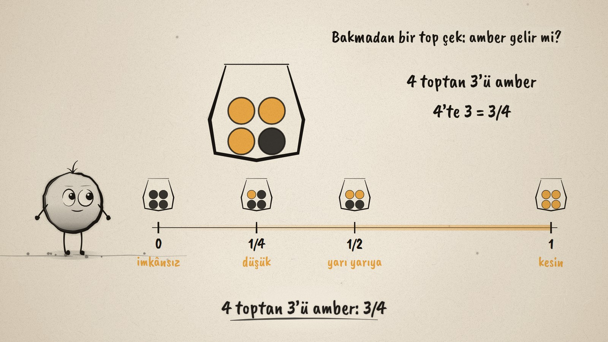
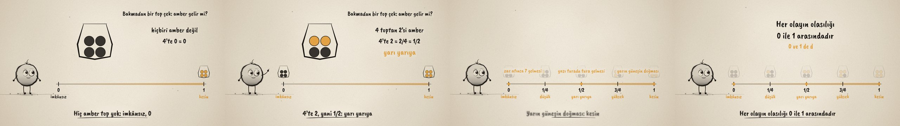

# İmkânsızdan Kesine · From Impossible to Certain

**▶ Tarayıcıda izleyin / Watch in the browser:** https://hakanatas.github.io/imkansizdan-kesine/ 
**⬇ MP4 + altyazılar / MP4 + subtitles:** [Releases](https://github.com/hakanatas/imkansizdan-kesine/releases) 
**✎ Kullanılan istem / The prompt behind it:** [PROMPT.md](PROMPT.md) 
**🎞 Bütün filmler / All films:** [Nokta'nın Filmleri](https://hakanatas.github.io/nokta-filmleri/)

> **TR —** 5. sınıf matematik "Veriden Olasılığa" temasındaki MAT.5.6.1 öğrenme çıktısı için hazırlanmış, tamamen JavaScript ile çizilen 92 saniyelik mürekkep animasyonu. Olay hep aynı: dört toplu bir torbadan bakmadan bir top çekince amber gelmesi. Torbalar değişiyor: 4 amber (kesin, 1), hiç amber yok (imkânsız, 0), 2 amber (4'te 2 = 1/2, yarı yarıya), 1 amber (1/4, düşük olasılık), 3 amber (3/4, yüksek olasılık). Her torba küçülüp olasılık çizgisine yerleşiyor. Sonra günlük olaylar da çizgiye konuyor: zarda 7 gelmesi (0), yazı turada tura (1/2), yarın güneşin doğması (1). Film "Her olayın olasılığı 0 ile 1 arasındadır; 0 ve 1 de dâhil" cümlesiyle bitiyor. Altyazılar Türkçe, İngilizce ya da ikisi birlikte seçilebilir.

A 92-second ink animation for **5th-grade maths**, drawn entirely with JavaScript on an HTML5 canvas. It is the first film of the *Veriden Olasılığa* theme, after the *Geometrik Şekiller*, *Geometrik Nicelikler* and *İstatistiksel Araştırma Süreci* films. Nokta, the ink character from [The Learning Ink](https://github.com/hakanatas/the-learning-ink), is the guide again.

## Learning outcome

MEB, Türkiye Yüzyılı Maarif Modeli, Ortaokul Matematik, 5th grade, "Veriden Olasılığa" theme:

**MAT.5.6.1. Herhangi bir olayın olasılığının 0 (imkânsız) ile 1 (kesin) arasında (0 ve 1 dâhil) olduğunu (olasılık spektrumu) yorumlayabilme**
- a) Olayları ve olası durumları inceler.
- b) Bir olayın olasılığına dair tahminlerini farklı sayı temsillerine dönüştürür.
- c) Kendi ifadeleriyle tahminde bulunduğu bir olayın olasılığının 0 ile 1 arasında (0 ve 1 dâhil) olduğunu ifade eder.

## Scenes

| # | Time | Scene | What happens | Outcome |
|---|---|---|---|---|
| 1 | 0–10 s | Ne kadar olası? | A bag of four balls. Draw one without looking: will it be amber? | a |
| 2 | 10–26 s | Kesin ve imkânsız | The probability line: 0 impossible, 1 certain. All four amber: certain, 1. No amber: impossible, 0. | a, c |
| 3 | 26–44 s | Yarı yarıya | 2 of 4 amber: 4'te 2 = 2/4 = 1/2, even chance, the middle of the line. | a, b |
| 4 | 44–62 s | Düşük ve yüksek | 1 of 4: 1/4, unlikely, close to 0. 3 of 4: 3/4, likely, close to 1. | b, c |
| 5 | 62–78 s | Günlük olaylar | Rolling a 7 on a die (0), heads on a coin (1/2), the sun rising tomorrow (1). | a, c |
| 6 | 78–92 s | Aklında kalsın | "Her olayın olasılığı 0 ile 1 arasındadır; 0 ve 1 de dâhil." Nokta celebrates. | c |

## Running it

- **Preview:** double-click `index.html` (it works offline).
- **MP4:** run `npm install` once, then `npm run export -- --format=horizontal --captions=tr`.
- **Subtitles and narration:** `npm run srt` writes `out/captions_*.srt` and `narration_notes.txt`.
- **Editing:**
  - Caption text, timings and narration notes: `captions.js`
  - Everything on screen is drawn by `LI.world(t)` in `scenes/scene1.js` (bags, the probability line, everyday events, the rule); the other scenes only set the camera.
  - The bags and their timing (`BAGS`, `bagT`), the everyday events (`DAILY`), the bag drawing (`bag`) and Nokta's poses: `src/draw/film.js`; layout for 16:9 and 9:16: `src/draw/kd.js`

It uses the same engine as The Learning Ink: `renderFrame(t)` as a pure function of time, seeded randomness, and frame-by-frame export.
